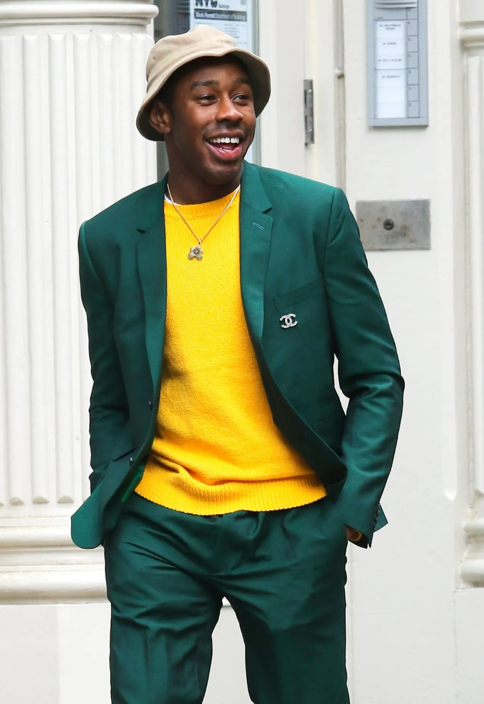
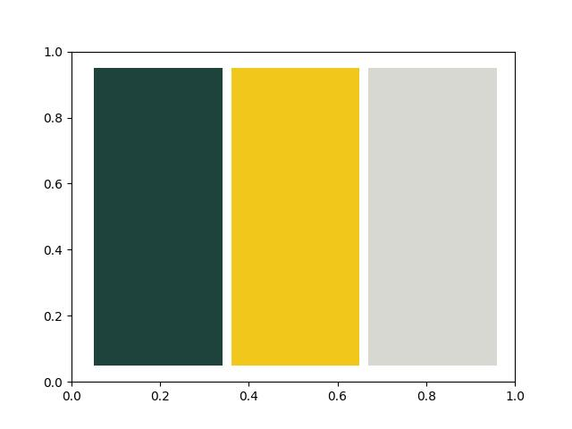

# outfit-color
Image processing Team Project 02  
Outfit color analyzer using OpenCV technology.  

## Pedestrian detection
### Input  

### Output  
 

## Clothes color detection
### Input
 

### Output
 

> - image source: https://www.gq.com/story/why-normal-ass-clothes-are-the-best-way-to-dress-right-now
> 
> - code source(color detection): https://stackoverflow.com/questions/37022787/color-detection-of-object-in-image   
> 
> - code source(pedestrian detection): https://www.geeksforgeeks.org/pedestrian-detection-using-opencv-python/